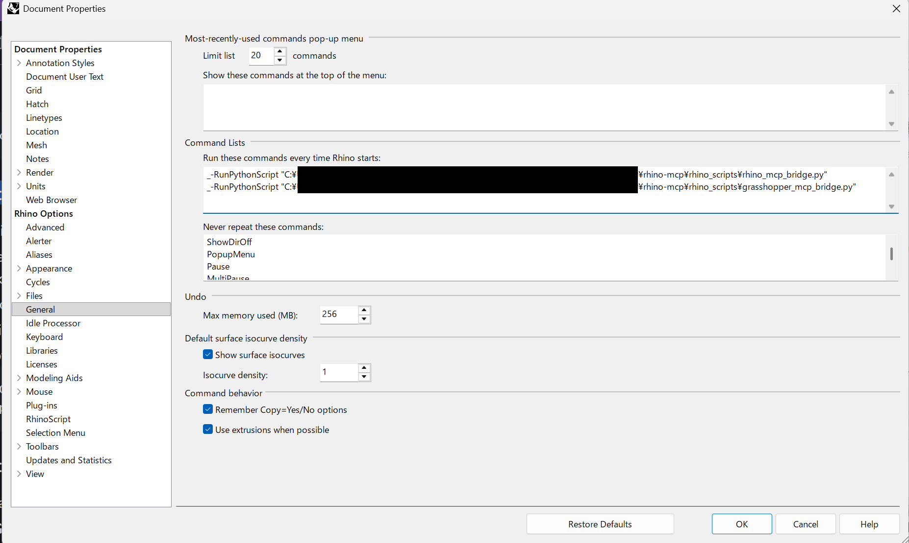

# RhinoMCP - Rhino Model Context Protocol Integration

**[ 日本語 (Japanese) ](README_JP.md)**

RhinoMCP connects Rhino, Grasshopper and more to AI Agents through the Model Context Protocol (MCP), allowing them to directly interact with and control Rhino + Grasshopper. If you provide a replicate.com api key you can also AI render images. This integration enables prompt-assisted 3D modeling, scene creation, and manipulation. (inspired by [blender_mcp](https://github.com/ahujasid/blender-mcp))

## Features

#### Rhino
- **Two-way communication**: Connect AI to Rhino through a socket-based server
- **Object manipulation and management**: Create and modify 3D objects in Rhino including metadata
- **Layer management**: View and interact with Rhino layers
- **Scene inspection**: Get detailed information about the current Rhino scene (incl. screencapture) 
- **Code execution**: Run arbitrary Python code in Rhino from AI

#### Grasshopper
- **Code execution**: Run arbitrary Python code in Grasshopper from AI - includes the generation of gh components
- **Gh canvas inspection**: Get detailed information about your Grasshopper definition, including component graph and parameters
- **Component management**: Update script components, modify parameters, and manage code references
- **External code integration**: Link script components to external Python files for better code organization
- **Real-time feedback**: Get component states, error messages, and runtime information
- **Non-blocking communication**: Stable two-way communication via HTTP server

#### Replicate
- **AI Models**: replicate offers thousands of AI models via API, implemented here: a stable diffusion variant 

## Project Structure

The project follows a standard `src` layout:

- `src/rhino_mcp/`: **MCP Server Code** (Python 3.x). Implements the MCP protocol and communicates with Rhino/Grasshopper.
- `rhino_scripts/`: **Bridge Scripts** (IronPython 2.7). Scripts that run inside Rhino and Grasshopper to handle commands.
  - `rhino_mcp_bridge.py`: For Rhino integration.
  - `grasshopper_mcp_bridge.py`: For Grasshopper integration.

## Installation

### Prerequisites

- Rhino 7 or newer
- Python 3.10 or newer
- `uv` (Recommended) or `pip`

### Setting up the Python Environment

We recommend using `uv` for fast and reliable dependency management.

1. Clone this repository.

2. Create a virtual environment and install dependencies:
   ```bash
   # Create virtual environment
   python -m venv .venv
   
   # Activate environment (Windows)
   .venv\Scripts\activate
   # Activate environment (Mac/Linux)
   source .venv/bin/activate
   
   # Install package in editable mode
   pip install -e .
   ```
   
   Or using `uv` directly:
   ```bash
   uv sync
   ```

### Automating MCP Bridge Startup on Rhino Launch

To avoid running the scripts manually every time you start Rhino, you can add them to the Rhino startup commands:

1. Open Rhino.
2. Go to **Tools** -> **Options** -> **General** (You can also access this from **File** -> **Properties** -> **General**).
3. Under **Command Lists**, find the box labeled **Run these commands every time Rhino starts:**. Add the following commands, replacing `C:\path\to\rhino-mcp` with the absolute path to your project folder:
   ```
   _-RunPythonScript "C:\path\to\rhino-mcp\rhino_scripts\rhino_mcp_bridge.py"
   _-RunPythonScript "C:\path\to\rhino-mcp\rhino_scripts\grasshopper_mcp_bridge.py"
   ```
4. Click **OK** and restart Rhino.



## Configuration

### Claude Desktop Integration

1. Go to Claude Desktop > Settings > Developer > Edit Config 
2. Open the `claude_desktop_config.json` file and add the following configuration:

**Windows (Example):**
```json
{
    "mcpServers": {
        "rhino": {
            "command": "uv",
            "args": [
                "run",
                "--directory",
                "C:\\path\\to\\rhino-mcp",
                "-m",
                "rhino_mcp.server"
            ]
        }
    }
}
```

**Mac/Linux (Example):**
```json
{
    "mcpServers": {
        "rhino": {
            "command": "uv",
            "args": [
                "run",
                "--directory",
                "/path/to/rhino-mcp",
                "-m",
                "rhino_mcp.server"
            ]
        }
    }
}
```

### Cursor IDE Integration

1. Locate or create the file `~/.cursor/mcp.json` (or project specific `.cursor/mcp.json`)
2. Add the same configuration as above.

## Usage

Once configured, the MCP server will start automatically when you open Claude Desktop or Cursor.
Make sure the **Rhino bridge script** is running in Rhino before attempting to use the tools.

### Example Prompts

- "Get information about the current Rhino scene"
- "Create a cube at the origin"
- "Grasshopperでシンプルなパラメトリックタワーを作って" (Create a simple parametric tower in Grasshopper)

## Troubleshooting

- **Connection issues**: 
  - Make sure the Rhino script is running (check Python Editor output)
  - Verify port 9876 (Rhino) or 9999 (Grasshopper) is not in use.
- **Path errors**:
  - Ensure `claude_desktop_config.json` points to the correct project root directory (where `pyproject.toml` is located).

## License

This project is open source and available under the MIT License.

